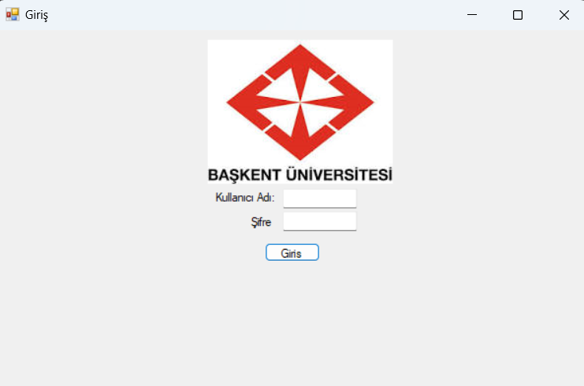
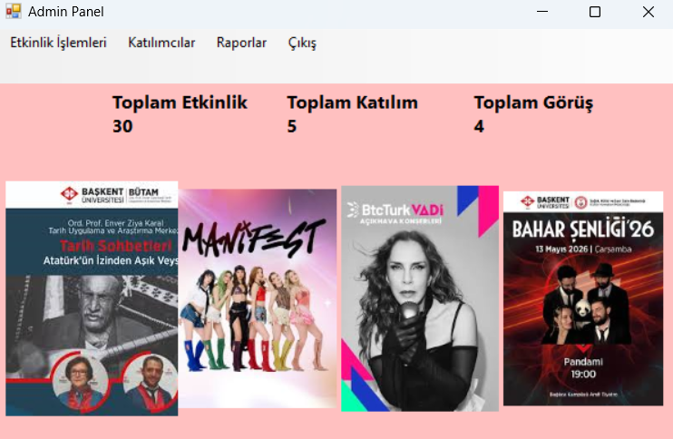
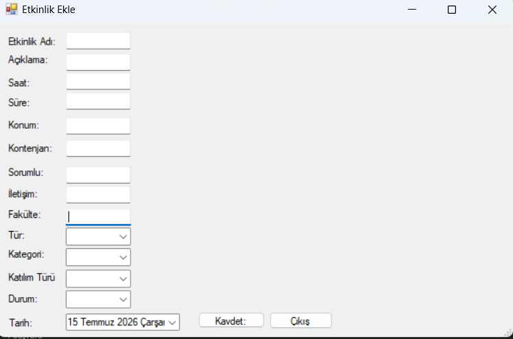
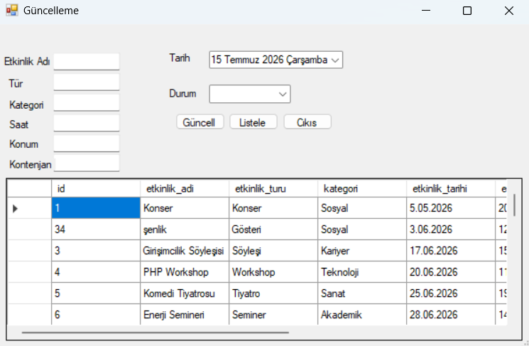
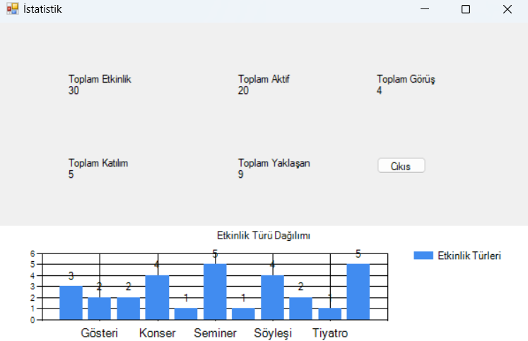
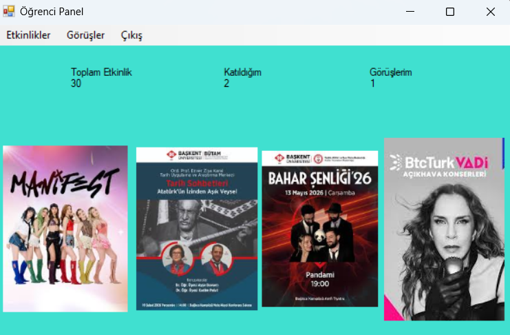
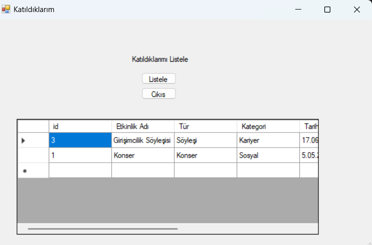
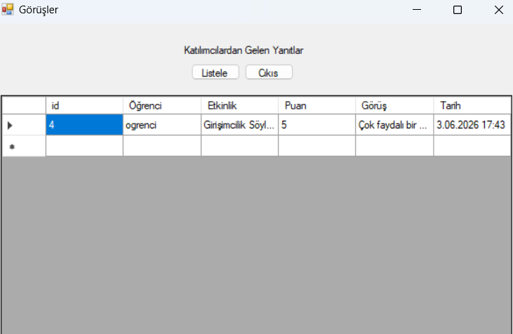

# 🎓 School Event Management System (Desktop)

A desktop-based School Event Management System developed using **C#, Windows Forms, and MySQL**. The application provides separate interfaces for administrators and students, allowing efficient event management, participation, and feedback tracking.

---

##  Features

###  Admin Panel

- Secure administrator login
- Add new events
- Update event information
- View all events
- View student participations
- Review student feedback
- View event statistics

###  Student Panel

- Secure student login
- Browse available events
- Join events
- View joined events
- Submit feedback for attended events
- Secure logout

---

#  Test Accounts

###  Administrator

**Username**

```text
admin
```

**Password**

```text
12345
```

---

### 👨‍🎓 Student

**Username**

```text
ogrenci
```

**Password**

```text
12345
```

---

## 🛠 Technologies Used

- C#
- Windows Forms
- MySQL

---


##  Login Screen



---

##  Admin Panel



---

##  Add Event



---

##  Update Event



---

##  All Events


---


##  Statistics



---

##  Student Panel



---

##  Joined Events



---

##  Feedback



---


#  Installation

1. Download or clone the repository.
2. Open the solution using **Visual Studio 2022**.
3. Import the provided MySQL database.
4. Update the database connection string if necessary.
5. Build and run the project.

---

#  Database

Import the SQL file located in the **database** folder before running the project.

---


#  Project Purpose

The purpose of this project is to simplify school event management through a desktop application. Administrators can organize events, monitor participations, and review student feedback, while students can browse events, join activities, and submit feedback using an intuitive interface.

---

#  Developer

**Zeynep Doğan**

Software Developer


🔗 GitHub: https://github.com/zeyneepdoogan


